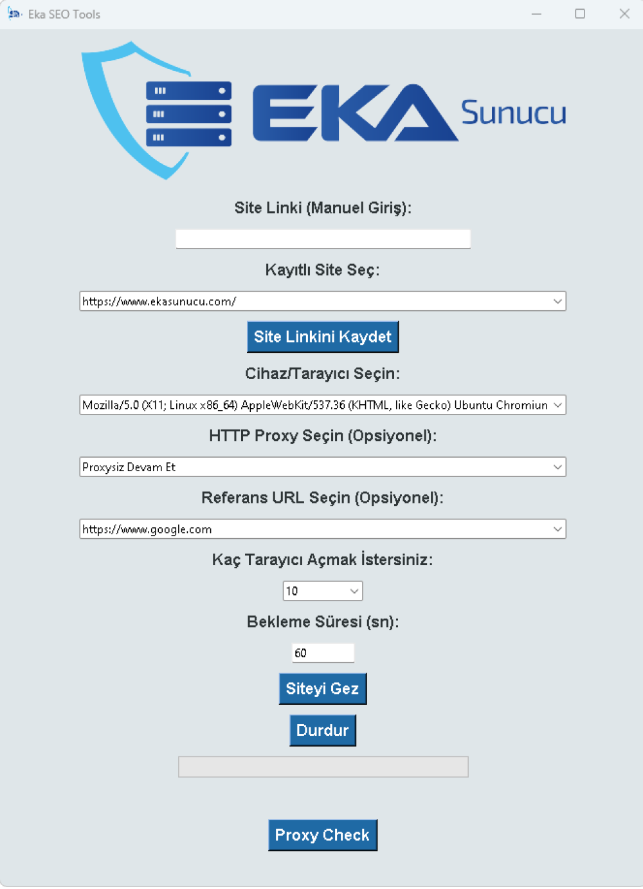

# Eka SEO Tools - Web Site Trafiğini Artırın ve Analiz Edin!

**Eka SEO Tools**, web sitenizin trafiğini analiz etmenize ve artırmanıza yardımcı olan güçlü bir araçtır. Bu yazılım, çeşitli web sitelerine otomatik olarak gezinebilir, kullanıcı davranışlarını taklit edebilir ve proxy kontrolü yaparak farklı IP'ler üzerinden siteye erişim sağlar. Aynı zamanda birden fazla tarayıcıda aynı anda çalışarak etkili bir SEO analizi yapmanıza olanak tanır.

## Temel Özellikler

- **Otomatik Site Gezinme:**
  - Siteye otomatik olarak bağlanır, sayfada kaydırma yapar ve menülere tıklayarak kullanıcının gezinme davranışını taklit eder.
- **Birden Fazla Tarayıcı Desteği:**
  - Aynı anda birden fazla tarayıcı penceresi açabilir ve her birinde bağımsız olarak siteyi gezebilir.
- **Proxy Kullanımı:**
  - Farklı proxy sunucuları üzerinden siteye bağlanarak IP çeşitliliği sağlar ve SEO çalışmalarınızı daha etkili hale getirir.
- **Proxy Kontrolü:**
  - Seçilen proxy'nin geçerliliğini kontrol eder ve geçersiz proxy'leri ayıklar.
- **Referans URL Ayarlama:**
  - Web sitenize belirli bir referans URL'si (Facebook, Twitter, Google, Bing, vb.) ile bağlanabilir.
- **User-Agent Seçimi:**
  - Farklı cihaz ve tarayıcıları taklit edebilme özelliği sayesinde, web sitenizin farklı ortamlarda nasıl göründüğünü test edebilirsiniz.
- **Zamanlayıcı:**
  - Site gezinmesi sırasında kalan süreyi yeşilden kırmızıya geçiş yaparak gösterir.
- **Kayıtlı Site Linkleri:**
  - Kayıtlı sitelerden seçim yaparak kolayca tarayıcı başlatabilirsiniz.

## Kullanım Kolaylığı

- **Kullanıcı Dostu Arayüz:**
  - Basit ve şık bir arayüzle, tüm işlemlerinizi tek bir ekrandan gerçekleştirebilirsiniz.
- **Kolay Kurulum:**
  - Tek tıklama ile programı indirip, kullanmaya başlayabilirsiniz.
- **Manuel ve Otomatik Seçenekler:**
  - Hem manuel olarak site linki girebilir hem de daha önce kaydedilmiş sitelerden seçim yapabilirsiniz.

## Kurulum Talimatları

### Kurulum ve Kullanım:

1. **İndir ve Kur:**
   - [Eka SEO Tools](https://www.ekasunucu.com/yazilim/eka-seo-tools-web-site-trafigini-artirin-ve-analiz-edin)'u indirin ve bilgisayarınıza kurun.
2. **Site Linkini Girin:**
   - Gezinmek istediğiniz site linkini manuel olarak girin veya kayıtlı sitelerden birini seçin.
3. **Ayarları Yapın:**
   - Proxy, referans URL ve user-agent gibi ayarları dilediğiniz gibi yapılandırın.
4. **Siteyi Gezin:**
   - "Siteyi Gez" butonuna tıklayarak işlemi başlatın. Program, belirttiğiniz süre boyunca otomatik olarak siteyi gezecek.

**Eka SEO Tools**, SEO çalışmalarınızı hızlandırmak ve web sitenizin performansını artırmak için mükemmel bir araçtır. Herhangi bir sorunuz varsa veya yardım almak isterseniz, [İletişim Sayfamız](mailto:info@ekayazilim.com.tr) üzerinden bize ulaşabilirsiniz.

## Ekran Görüntüsü

## İletişim

Bu yazılım hakkında daha fazla bilgi almak için [Eka Sunucu](https://www.ekasunucu.com/yazilim/eka-seo-tools-web-site-trafigini-artirin-ve-analiz-edin) sayfasını ziyaret edebilirsiniz.

Yazılım çözümleri ve diğer projeler hakkında daha fazla bilgi almak için [Eka Sunucu](https://www.ekasunucu.com/) ve [Eka Yazılım](https://ekayazilim.com.tr) sitelerine göz atabilirsiniz.

VDS hizmetleri için [VDS Satın Al](https://www.ekasunucu.com/kategori/turkiye-lokasyon-vds-vps) sayfasını, ekran kartlı sunucu hizmetleri için [Ekran Kartlı Sunucu](https://www.ekasunucu.com/kategori/ekran-kartli-sunucu) sayfasını ziyaret edebilirsiniz.

İletişim:  
E-posta: [info@ekayazilim.com.tr](mailto:info@ekayazilim.com.tr)  
Telefon: 0850 307 34 58
